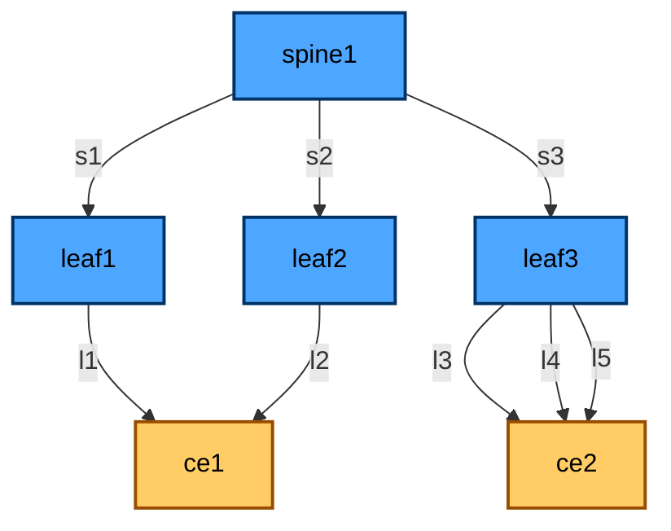

based on:
https://github.com/srl-labs/srl-evpn-mh-lab



Linux VRF support is needed on KinD host:
```
sudo apt update && sudo apt install linux-modules-extra-$(uname -r) --no-install-suggests -y
sudo modprobe vrf
```

Start topology:
```
helm install mh netclab/netclab --values topology_evpn_mh.yaml
```

Configure nodes:
```
CE1_CONFIG="https://github.com/srl-labs/srl-evpn-mh-lab/raw/refs/heads/main/configs/ce1-config.sh"
CE2_CONFIG="https://github.com/srl-labs/srl-evpn-mh-lab/raw/refs/heads/main/configs/ce2-config.sh"
LEAF1_CONFIG="https://github.com/srl-labs/srl-evpn-mh-lab/raw/refs/heads/main/configs/leaf1.cfg"
LEAF2_CONFIG="https://github.com/srl-labs/srl-evpn-mh-lab/raw/refs/heads/main/configs/leaf2.cfg"
LEAF3_CONFIG="https://github.com/srl-labs/srl-evpn-mh-lab/raw/refs/heads/main/configs/leaf3.cfg"
SPINE1_CONFIG="https://github.com/srl-labs/srl-evpn-mh-lab/raw/refs/heads/main/configs/spine1.cfg"

kubectl exec ce1 -- sh -c "source <(curl -sL $CE1_CONFIG)"
kubectl exec ce2 -- sh -c "source <(curl -sL $CE2_CONFIG)"
kubectl exec leaf1 -- bash -c "sr_cli -ec < <(ip netns exec srbase-mgmt curl -sL $LEAF1_CONFIG)"
kubectl exec leaf2 -- bash -c "sr_cli -ec < <(ip netns exec srbase-mgmt curl -sL $LEAF2_CONFIG)"
kubectl exec leaf3 -- bash -c "sr_cli -ec < <(ip netns exec srbase-mgmt curl -sL $LEAF3_CONFIG)"
kubectl exec spine1 -- bash -c "sr_cli -ec < <(ip netns exec srbase-mgmt curl -sL $SPINE1_CONFIG)"
```

Uninstall topology:
```
helm uninstall mh
```
