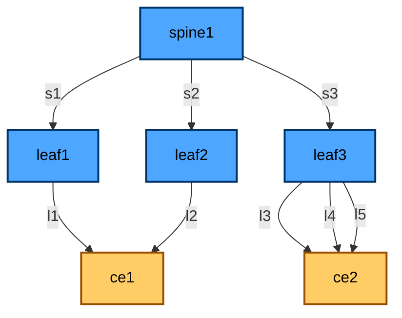

```mermaid
graph TD
    %% Auto-generated network topology diagram (networks as edge labels)

    spine1 -->|s1| leaf1
    spine1 -->|s2| leaf2
    spine1 -->|s3| leaf3
    leaf1 -->|l1| ce1
    leaf2 -->|l2| ce1
    leaf3 -->|l3| ce2
    leaf3 -->|l4| ce2
    leaf3 -->|l5| ce2

    %% Node styles
    classDef srlinux fill:#4da6ff,stroke:#003366,stroke-width:2px,color:#000000;
    classDef linux fill:#66ff66,stroke:#006600,stroke-width:2px,color:#000000;
    classDef ce fill:#ffcc66,stroke:#994d00,stroke-width:2px,color:#000000;
    class spine1 srlinux;
    class leaf1 srlinux;
    class leaf2 srlinux;
    class leaf3 srlinux;
    class ce1 ce;
    class ce2 ce;
```
