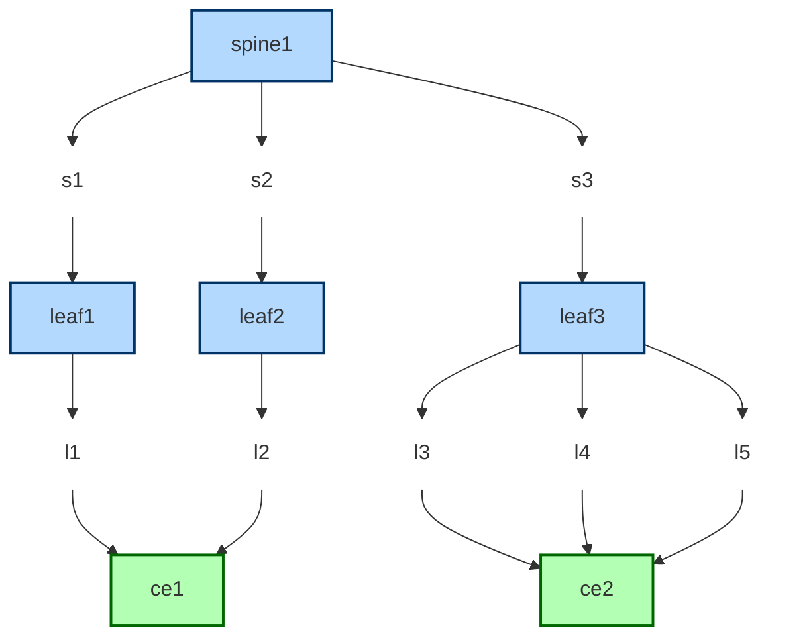

```mermaid
graph TD
    %% Auto-generated network topology diagram (networks as invisible nodes)

    classDef srlinux fill:#b3d9ff,stroke:#003366,stroke-width:2px;
    classDef linux fill:#b3ffb3,stroke:#006600,stroke-width:2px;
    classDef network fill:#ffffff,stroke:none,stroke-width:0px;

    spine1 --> s1
    s1 --> leaf1
    spine1 --> s2
    s2 --> leaf2
    spine1 --> s3
    s3 --> leaf3
    leaf1 --> l1
    l1 --> ce1
    leaf2 --> l2
    l2 --> ce1
    leaf3 --> l3
    l3 --> ce2
    leaf3 --> l4
    l4 --> ce2
    leaf3 --> l5
    l5 --> ce2
    class spine1 srlinux;
    class leaf1 srlinux;
    class leaf2 srlinux;
    class leaf3 srlinux;
    class ce1 linux;
    class ce2 linux;
    class s1 network;
    class s2 network;
    class s3 network;
    class l1 network;
    class l2 network;
    class l3 network;
    class l4 network;
    class l5 network;
```
